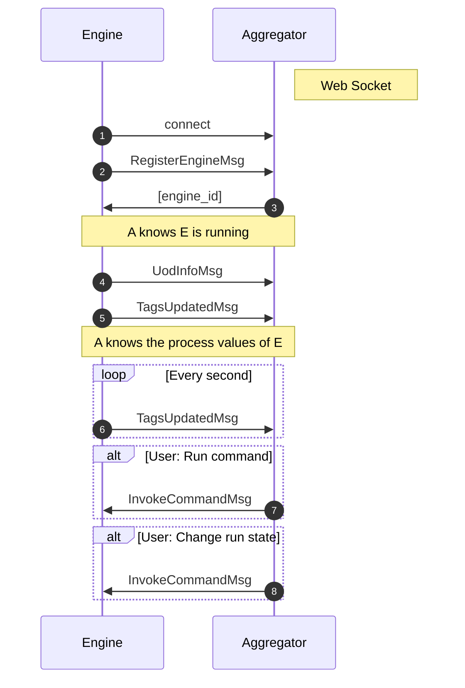

Notes:

# 1. Content

- [1. Content](#1-content)
- [2. Installation](#2-installation)
  - [2.1. Frontend installation](#21-frontend-installation)
  - [2.2. Backend installation](#22-backend-installation)
- [3. Running Open Pectus](#3-running-open-pectus)
  - [3.1. Aggregator](#31-aggregator)
  - [3.2. Engine](#32-engine)
  - [3.3. Docker](#33-docker)
- [4. Componets](#4-componets)
  - [4.1. Pectus UI](#41-pectus-ui)
  - [4.2. Aggregator](#42-aggregator)
  - [4.3. Engine](#43-engine)
- [5. Build validation](#5-build-validation)
  - [5.1. Flake](#51-flake)
  - [5.2. Mypy](#52-mypy)
  - [5.3. Code generation from API spec](#53-code-generation-from-api-spec)
- [6. Protocols](#6-protocols)
  - [6.1. Engine - Aggregator](#61-engine---aggregator)


# 2. Installation

This chapter describes how to set up a development environment to run and develop Open Pectus.


## 2.1. Frontend installation

Prerequisites: Node (and npm) must be installed.

```
cd Open-Pectus/openpectus/frontend
npm ci
npm run build
```

## 2.2. Backend installation

Prerequisites:
- A conda installation. <a href="https://docs.conda.io/en/latest/miniconda.html">Miniconda</a> is recommended.
- Note: It is possible to install openpectus without conda but this will affect the global python environment on the developer pc
  so this in not recommended.

To create a new conda environment and install all dependencies:
```
cd Open-Pectus
conda env create -n=pectus --file=environment.yml
```


How to update an existing conda environment with all dependencies:
```
cd Open-Pectus
conda env update -n=pectus --file=environment.yml --prune
```

To install openpectus in the environment, run

```
cd Open-Pectus
pip install -e .
```

To install without conda (not recommended), run

```
cd Open-Pectus
pip install -r openpectus/requirements.txt
pip install -e .
```


The build server builds a distribution. This is not normally needed in a developer environment.
To build a distribution:

```
cd Open-Pectus
python -m build
```


# 3. Running Open Pectus

## 3.1. Aggregator

To start a local aggregator service:

Prerequisites:
- [2.1. Frontend installation](#21-frontend-installation)
- [2.2. Backend installation](#22-backend-installation)

Run Aggregator to serve frontend from its default build directory. This also starts the 
websocket protocol allowing Engines to connect.

```
cd Open-Pectus
pectus-aggregator -fdd .\openpectus\frontend\dist\
```

When Aggregator is running, the aggregator services are available, including:
Frontend:       http://localhost:9800/
OpenAPI UI:     http://localhost:9800/docs
OpenAPI spec:   http://localhost:9800/openapi.json


## 3.2. Engine
Run Engine to connect a local engine to the Aggregator above:

```
cd Open-Pectus
pectus-engine --aggregator_host localhost --aggregator_port 9800
```


## 3.3. Docker

Prerequisites:
- [2.1. Frontend installation](#21-frontend-installation)
- [2.2. Backend installation](#22-backend-installation)

To start aggregator services in docker, run the following command.
Note: This depends on the frontend and backend builds being up to date.

```
cd Open-Pectus/openpectus
docker compose up --build
```

When the container is running, the aggregator services are available, including:
Frontend:       http://localhost:8300/
OpenAPI UI:     http://localhost:8300/docs
OpenAPI spec:   http://localhost:8300/openapi.json


The frontend can now be used to verify that the engine is connected to the aggregator and to interact
with the engine.

An Engine can be started in the docker container using
```
pectus-engine --aggregator_host localhost --aggregator_port 8300
```


# 4. Componets

## 4.1. Pectus UI

This is a web application that allows users to view and interact with the Pectus system,
including runnings engines and process unit hardware attached to them.

## 4.2. Aggregator

There is one Aggregator service in a pectus system. It has the following responsibilities:

- Manage Engine services via a web-socket protocol
- Expose the Pectus UI web client application to end users
- Expose a rest API for Pectus UI
- Expose a web-socket API for Pectus UI. Used for two-way features not feasible in rest API.
- Expose a Language Server Protocol web-socket API for the Pectus UI code editor
- Parse and analyze pectus code (requires no running engine, only knowledge of the UOD)

## 4.3. Engine

An Engine service instance is required for each piece of process unit hardware. It has
the following responsibilities:

- Communicate with the hardware
- Expose hardware state as Tags
- Expose hardware interaction as Commands
- Parse(?), analyze(?) and run pectus code

# 5. Build validation

## 5.1. Flake
Flake is a python linter.

It is run by the build system to help ensure a decent code base. It outputs warnings and errors. The build will 
fail if flake returns errors.

Run flake (note the directory - this matters):

```
cd Open-Pectus/openpectus
flake8
```

## 5.2. Mypy
Mypy is a static type checker.

The Backend code base is annotated with type hints, such that Mypy can check the types. The build does not yet include this step
as there are still problems being worked out.

<!-- ## 3.5. Diagram generation

To get started with diagram generation, run the following command from the `openpectus` directory:
`pyreverse -k .`
Pyreverse is installed as part of pylint (which is somehow already installed).
 -->

## 5.3. Code generation from API spec

The frontend generates and uses typescript skeleton interfaces from the Aggregator API spec.

To ensure that the implemented backend, the API specification file and the typescript interfaces all match, the flow for modification is as follows:
1. A change is made in the Aggregator API implementation.
2. The script `update_api_spec_and_typescript.sh` must be manually invoked. This updates the api spec file and generates updated typescript interfaces from it.
3. The frontend build must be run to check the updated interfaces. If the frontend build fails, the build server build will fail. This indicates an integration error caused 
   by an incompatible API change. This should be fixed before the branch is merged, either by updating the frontend to support the API change or by reworking the API change to be compatible with the frontend.
4. Steps 1-3 must be repeated until both frontend and backend build successfully.
5. All changes must be committed to Git.

To ensure that step 2. is not forgotten, the aggregator test suite contains a test that checks that generates a new api spec file and checks that it matches the spec file last generated by the script. If it doesn't, the test fails and with it the Backend build.


# 6. Protocols

This chapter documents the Open Pectus web socket protocols.

## 6.1. Engine - Aggregator

