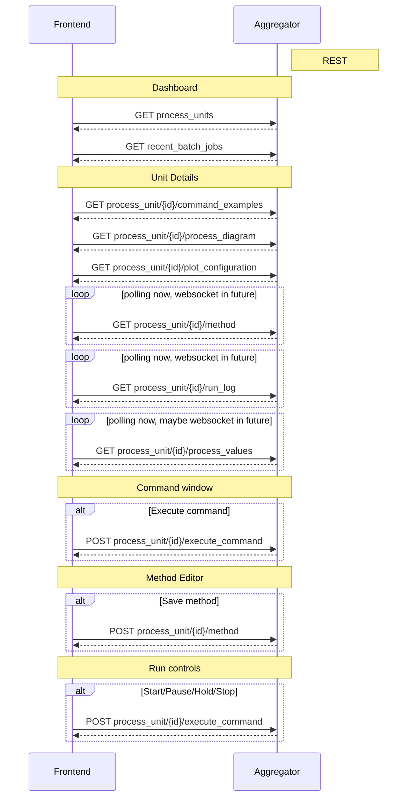
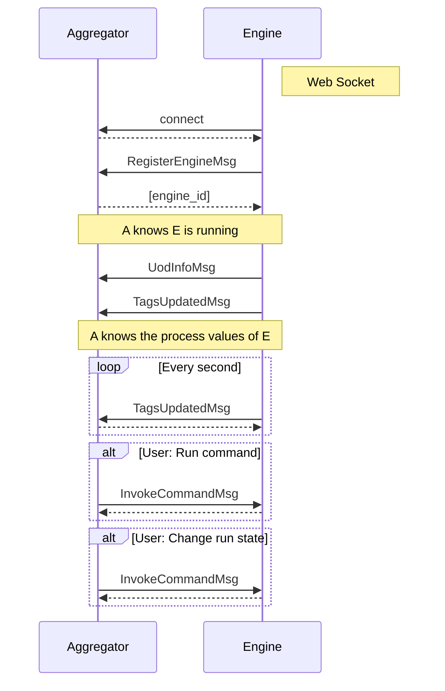

Notes:

# Content

- [Setup](#setup)
  - [Frontend setup](#frontend-setup)
  - [Backend setup](#backend-setup)
- [Running Open Pectus](#running-open-pectus)
  - [Aggregator](#aggregator)
  - [Engine](#engine)
  - [Docker](#docker)
- [User Authorization](#user-authorization)
  - [Azure AD](#azure-ad)
- [Components](#components)
  - [Pectus UI](#pectus-ui)
  - [Aggregator](#aggregator)
  - [Engine](#engine)
- [Build validation](#build-validation)
  - [Flake](#flake)
  - [Type checking](#type-checking)
    - [Mypy](#mypy)
    - [Pyright](#pyright)
    - [Comparison](#comparison)
  - [Code generation from API spec](#code-generation-from-api-spec)
- [Protocols](#protocols)
  - [Frontend - Aggregator](#frontend---aggregator)
  - [Engine - Aggregator](#engine---aggregator)


# Setup
This chapter describes how to set up a development environment to run and develop Open Pectus.


## Frontend setup
Prerequisites: Node 18 (LTS) must be installed.

```shell
cd Open-Pectus/openpectus/frontend
npm ci
npm run build
```

## Backend setup
Prerequisites:
- A conda installation. [Miniconda](https://docs.conda.io/en/latest/miniconda.html) is recommended.  
  _Note: It is possible to install open pectus without conda but this will affect the global python environment on the developer pc
  so this in not recommended._

All the following commands can only be run from within the (mini)conda prompt, and from the `Open-Pectus` folder.

### One-time setup

Create a new conda environment and install all dependencies:
```shell
conda env create -n=pectus --file=environment.yml
```

Activate the created pectus conda environment:
```shell
conda activate pectus
```

Install open pectus in the environment:
```shell
pip install -e .
```

### Other commands
#### To update an existing conda environment with all dependencies (e.g. when requirements.txt has changed):
```shell
conda env update -n=pectus --file=environment.yml --prune
```

#### To build a distribution:  
_The build server builds a distribution. This is not normally needed in a developer environment but can be necessary to test building docker images.  
Optionally, to include frontend in the build, build the frontend and copy the contents of `openpectus/frontend/dist` into `openpectus/aggregator/frontend-dist` before building the distribution._

```shell
python -m build -o openpectus/dist
```


# Running Open Pectus

## Aggregator

To start a local aggregator service:

Prerequisites:
- [Frontend setup](#frontend-setup)
- [Backend setup](#backend-setup)

Run Aggregator to serve frontend from its default build directory. This also starts the
websocket protocol allowing Engines to connect.

```shell
cd Open-Pectus
pectus-aggregator -fdd .\openpectus\frontend\dist\
```

When Aggregator is running, the aggregator services are available, including:
- Frontend:       http://localhost:9800/
- OpenAPI UI:     http://localhost:9800/docs
- OpenAPI spec:   http://localhost:9800/openapi.json


## Engine
Run Engine to connect a local engine to the Aggregator above:

```shell
cd Open-Pectus
pectus-engine --aggregator_host localhost --aggregator_port 9800
```


## Docker

Prerequisites:
- [Frontend setup](#frontend-setup)
- [Backend setup](#backend-setup)

To start aggregator services in docker, run the following command.
Note: This depends on the frontend and backend builds being up-to-date.

```shell
cd Open-Pectus/openpectus
docker compose up --build
```

When the container is running, the aggregator services are available, including:
- Frontend:       http://localhost:8300/
- OpenAPI UI:     http://localhost:8300/docs
- OpenAPI spec:   http://localhost:8300/openapi.json


The frontend can now be used to verify that the engine is connected to the aggregator and to interact
with the engine.

An Engine can be started in the docker container using
```shell
pectus-engine --aggregator_host localhost --aggregator_port 8300
```


# User Authorization

To ensure not everyone can access the data and control the experiments, as well as enable logging who did what, Pectus can integrate with an identity provider using an oAuth/OIDC login flow. 

Currently, we only support Azure AD.

Idp integration is controlled through environment variables, to enable different setups for local development, test/staging servers, and production environments.

## Azure AD
### Environment Variables
Set the following environment variables:
- `ENABLE_AZURE_AUTHENTICATION`: true/false to enable/disable Azure AD integration.
- `AZURE_DIRECTORY_TENANT_ID`: The "directory tenant id" GUID for your Azure AD tenant/directory.
- `AZURE_APPLICATION_CLIENT_ID`: The client id for the pectus-specific configuration in Azure AD.

All three environment variables must be provided, (and `ENABLE_AZURE_AUTHENTICATION` set to `true`), for the integration to work.

### Callback URL
The Azure AD pectus-specific configuration must also be configured to include `<your host>/auth-callback` where `<your host>` includes `http(s)://` and the port number, if it is not the default

E.g. if running locally on a development machine, using `npm start`, the callback url should be `http://localhost:4200/auth-callback`

# Components

## Pectus UI

This is a web application that allows users to view and interact with the Pectus system,
including runnings engines and process unit hardware attached to them.

## Aggregator

There is one Aggregator service in a pectus system. It has the following responsibilities:

- Manage Engine services via a web-socket protocol
- Expose the Pectus UI web client application to end users
- Expose a rest API for Pectus UI
- Expose a web-socket API for Pectus UI. Used for two-way features not feasible in rest API.
- Expose a Language Server Protocol web-socket API for the Pectus UI code editor
- Parse and analyze pectus code (requires no running engine, only knowledge of the UOD)

## Engine

An Engine service instance is required for each piece of process unit hardware. It has
the following responsibilities:

- Communicate with the hardware
- Expose hardware state as Tags
- Expose hardware interaction as Commands
- Parse(?), analyze(?) and run pectus code

# Build validation

## Flake
Flake is a python linter.

It is run by the build system to help ensure a decent code base. It outputs warnings and errors. The build will
fail if flake returns errors.

Run flake (note the directory - this matters):

```shell
cd Open-Pectus/openpectus
flake8
```

## Type checking


### Mypy
Mypy is a static type checker.

The Backend code base is annotated with type hints, such that Mypy can check the types. The build does not yet include this step
as there are still problems being worked out.

It is configured in pyproject.toml.

To manually invoke, run
```shell
cd Open-Pectus
mypy
```

### Pyright
Pyright is another static type checker.

Work in underway to assess it. Once assessed, we will use either Mypy or Pyright, not both.

It is configured in pyproject.toml. Configuration reference: https://github.com/microsoft/pyright/blob/main/docs/configuration.md

To manually invoke, run
```shell
cd Open-Pectus
pyright
```

It is updated very frequently. To update it, run
```shell
pip install -U pyright
```

### Comparison

**MyPy**
* Pros
  * Standard in Python land
* Cons
  * Has quite a few issues with no good solutions, e.g. StrEnum, auto()
  * Seems to have lots of legacy, e.g. troublesome configuration.

**Pyright**
* Pro
  * VS Code uses it so it reports the same issues
  * Easy configuration
  * VS Code understand its configuration, even in pyproject.toml. So config changes apply immediately
  * Does not report errors for StrEnum, auto()
* Con
  * Non-standard in Python land
  * Seems a little heavy on deps - node installs stuff on first start
  * Remains to be seen if it catches the same errors that Mypy does

<!-- ## Diagram generation

To get started with diagram generation, run the following command from the `openpectus` directory:
`pyreverse -k .`
Pyreverse is installed as part of pylint (which is somehow already installed).
 -->

## Code generation from API spec

The frontend generates and uses typescript skeleton interfaces from the Aggregator API spec.

To ensure that the implemented backend, the API specification file and the typescript interfaces all match, the flow for modification is as follows:
1. A change is made in the Aggregator API implementation.
2. The script `update_api_spec_and_typescript.sh` must be manually invoked. This updates the api spec file and generates updated typescript interfaces from it.
3. The frontend build must be run to check the updated interfaces. If the frontend build fails, the build server build will fail. This indicates an integration error caused
   by an incompatible API change. This should be fixed before the branch is merged, either by updating the frontend to support the API change or by reworking the API change to be compatible with the frontend.
4. Steps 1-3 must be repeated until both frontend and backend build successfully.
5. All changes must be committed to Git.

To ensure that step 2 is not forgotten, the aggregator test suite contains a test that checks that generates a new api spec file and checks that it matches the spec file last generated by the script. If it doesn't, the test fails and with it the Backend build.


# Protocols

This chapter documents the Open Pectus Rest and Websocket protocols.

## Frontend - Aggregator


## Engine - Aggregator


