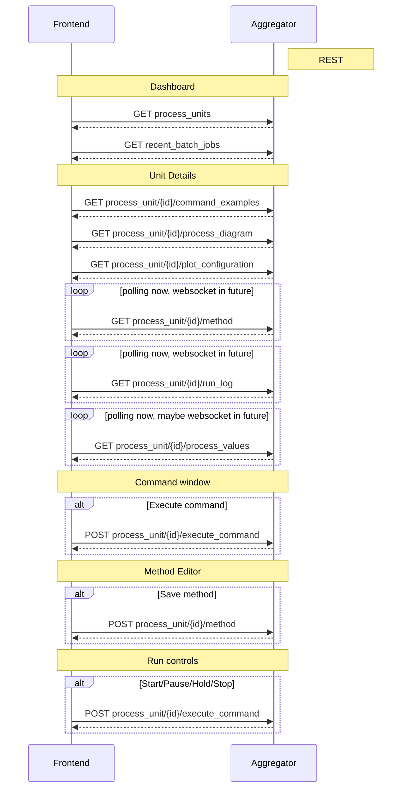
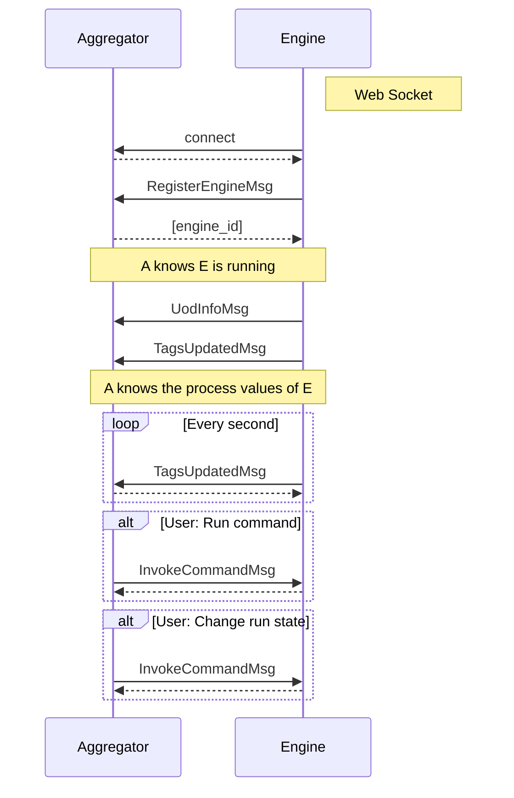
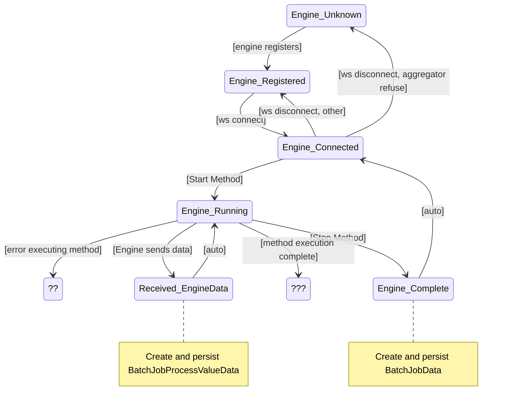

Notes:

# 1. Content
- [1. Content](#1-content)
- [2. Setup](#2-setup)
  - [2.1. Frontend setup](#21-frontend-setup)
  - [2.2. Backend setup](#22-backend-setup)
    - [2.2.1. One-time setup](#221-one-time-setup)
    - [2.2.2. Other commands](#222-other-commands)
- [3. Running Open Pectus](#3-running-open-pectus)
  - [3.1. Aggregator](#31-aggregator)
  - [3.2. Engine](#32-engine)
  - [3.3. Docker](#33-docker)
- [4. User Authorization](#4-user-authorization)
  - [4.1. Azure AD](#41-azure-ad)
    - [4.1.1. Environment Variables](#411-environment-variables)
    - [4.1.2. Callback URL](#412-callback-url)
- [5. Components](#5-components)
  - [5.1. Pectus UI](#51-pectus-ui)
  - [5.2. Aggregator](#52-aggregator)
  - [5.3. Engine](#53-engine)
- [6. Build validation](#6-build-validation)
  - [6.1. Flake](#61-flake)
  - [6.2. Type checking](#62-type-checking)
    - [6.2.1. Pyright](#621-pyright)
  - [6.3. Code generation from API spec](#63-code-generation-from-api-spec)
- [7. Protocols](#7-protocols)
  - [7.1. Frontend - Aggregator](#71-frontend---aggregator)
  - [7.2. Engine - Aggregator](#72-engine---aggregator)
  - [7.3 Aggregator states per engine](#73-aggregator-states-per-engine)

<!-- ToC and section numbering generated by "Markdown All in One" plugin for VSCode -->

# 2. Setup
This chapter describes how to set up a development environment to run and develop Open Pectus.


## 2.1. Frontend setup
Prerequisites: Node 20 (LTS) must be installed.

```shell
cd Open-Pectus/openpectus/frontend
npm ci
npm run build
```

## 2.2. Backend setup
Prerequisites:
- A conda installation. [Miniconda](https://docs.conda.io/en/latest/miniconda.html) is recommended.
  _Note: It is possible to install open pectus without conda but this will affect the global python environment on the developer pc
  so this in not recommended._
- Java SE SDK (optional, only needed for parser generation when updating P-code grammar)
  - The simplest way to get going using VS Code is this:
    - Install java using `conda install -c conda-forge openjdk`
    - Install VS Code extension 'ANTLR4 grammar syntax support' (https://github.com/mike-lischke/vscode-antlr4)
    - This should cause the Antlr plugin to automatically regenerate parser code whenever pcode.g4 is modified. 
    - openjdk-21.0.2 is known to work.

All the following commands can only be run from within the (mini)conda prompt, and from the `Open-Pectus` folder.

### 2.2.1. One-time setup

Create a new conda environment and install all dependencies:
```shell
conda env create -p=./conda --file=environment.yml
```

Activate the created pectus conda environment:
```shell
conda activate ./conda
```

Install open pectus in the environment:
```shell
pip install -e .
```

Set the SENTRY_DSN environment variable (optional):
To enable the sentry logger, the SENTRY_DSN environment variable needs to be set.
* Find the value by logging in to https://sentry.io and navigate to `settings/projects/openpectus/keys`
* Save the value as an environment variable on your developer pc:
```shell
setx SENTRY_DSN value
```


### 2.2.2. Other commands
**To update an existing conda environment with all dependencies (e.g. when requirements.txt has changed):**
```shell
conda env update -p=./conda --file=environment.yml --prune
```


**To build a distribution:**
_The build server builds a distribution. This is not normally needed in a developer environment but can be necessary to test building docker images.
Optionally, to include frontend in the build, build the frontend and copy the contents of `openpectus/frontend/dist` into `openpectus/aggregator/frontend-dist` before building the distribution._

```shell
python -m build -o openpectus/dist
```


**To create a new migration script:**  

Change the database model(s) in aggregator/data/models.py first, then run:
```shell
alembic revision --autogenerate -m "<migration script name>"
```
This will create a new migration script in `aggregator/data/alembic/versions/` based on the model changes.  
You **must** check that the changes within are acceptable, and change them if they are not.  
It is a good idea to ensure the downgrade step will leave data as it was.  
See https://alembic.sqlalchemy.org/en/latest/autogenerate.html#what-does-autogenerate-detect-and-what-does-it-not-detect for what autogenerate will and will not detect.

You can then test your migration with `alembic upgrade head` and `alembic downgrade -1`.  
`alembic upgrade head` is automatically run when aggregator starts, in aggregator/main.py main() function.

Currently, automatic tests touching the database does not use the migration scripts, so you can't trust those to verify the migrations.

SQLite has some severe limitations on what schema changes it supports. e.g. it doesn't support altering a column besides renaming it: https://sqlite.org/lang_altertable.html  
To alter e.g. a column type, you will need to create a new table, copy the data over, and then drop the old one.
Alembic supports this with "batch" migrations: https://alembic.sqlalchemy.org/en/latest/batch.html  
The autogenerate feature has been configured to generate with batch migrations as described here: https://alembic.sqlalchemy.org/en/latest/batch.html#batch-mode-with-autogenerate

The python driver for SQLite (pysqlite) does NOT support transactional DDL, i.e. running schema changes in a transaction so a failure during a schema change will roll all the changes back: https://docs.sqlalchemy.org/en/20/dialects/sqlite.html#transactional-ddl  
Alembic will run each migration separately, so if something fails, only the last change will require cleanup. https://github.com/sqlalchemy/alembic/issues/755#issuecomment-729110204  
There is possibly a workaround for this: https://docs.sqlalchemy.org/en/20/dialects/sqlite.html#serializable-isolation-savepoints-transactional-ddl but I believe Alembic would still not use it correctly as its behaviour in `alembic/runtime/migration.py` depends on the `transactional_ddl` flag set to False in `alembic/ddl/sqlite.py`

Even though the autogenerated migrations will include foreign key constraints, they are not enforced by SQLite by default, and while enabling them is possible in SQLAlchemy, it has some severe downsides: https://docs.sqlalchemy.org/en/20/dialects/sqlite.html#foreign-key-support

Even though `Mapped[]` python enum types produce Alembic Enums in the autogenerated migrations, they will not actually be enforced on database level without manually writing some CHECK constraints, or foreign keys to an enum table. It's unclear whether this would be worth the added complexity and management.

# 3. Running Open Pectus

## 3.1. Aggregator

To start a local aggregator service:

Prerequisites:
- [Frontend setup](#frontend-setup)
- [Backend setup](#backend-setup)

Run Aggregator to serve frontend from its default build directory. This also starts the
websocket protocol allowing Engines to connect.

```shell
cd Open-Pectus
pectus-aggregator -fdd .\openpectus\frontend\dist\
```

When Aggregator is running, the aggregator services are available, including:
- Frontend:       http://localhost:9800/
- OpenAPI UI:     http://localhost:9800/docs
- OpenAPI spec:   http://localhost:9800/openapi.json


## 3.2. Engine
Run Engine to connect a local engine to the Aggregator above:

```shell
cd Open-Pectus
pectus-engine --aggregator_host localhost --aggregator_port 9800
```


## 3.3. Docker

Prerequisites:
- [Frontend setup](#frontend-setup)
- [Backend setup](#backend-setup)

To start aggregator services in docker, run the following command.
Note: This depends on the frontend and backend builds being up-to-date.

```shell
cd Open-Pectus/openpectus
docker compose up --build
```

When the container is running, the aggregator services are available, including:
- Frontend:       http://localhost:8300/
- OpenAPI UI:     http://localhost:8300/docs
- OpenAPI spec:   http://localhost:8300/openapi.json


The frontend can now be used to verify that the engine is connected to the aggregator and to interact
with the engine.

An Engine can be started in the docker container using
```shell
pectus-engine --aggregator_host localhost --aggregator_port 8300
```


# 4. User Authorization

To ensure not everyone can access the data and control the experiments, as well as enable logging who did what, Pectus can integrate with an identity provider using an oAuth/OIDC login flow.

Currently, we only support Azure AD.

Idp integration is controlled through environment variables, to enable different setups for local development, test/staging servers, and production environments.

## 4.1. Azure AD
### 4.1.1. Environment Variables
Set the following environment variables:
- `ENABLE_AZURE_AUTHENTICATION`: true/false to enable/disable Azure AD integration.
- `AZURE_DIRECTORY_TENANT_ID`: The "directory tenant id" GUID for your Azure AD tenant/directory.
- `AZURE_APPLICATION_CLIENT_ID`: The client id for the pectus-specific configuration in Azure AD.

All three environment variables must be provided, (and `ENABLE_AZURE_AUTHENTICATION` set to `true`), for the integration to work.

### 4.1.2. Callback URL
The Azure AD pectus-specific configuration must also be configured to include `<your host>/auth-callback` where `<your host>` includes `http(s)://` and the port number, if it is not the default

E.g. if running locally on a development machine, using `npm start`, the callback url should be `http://localhost:4200/auth-callback`

# 5. Components

## 5.1. Pectus UI

This is a web application that allows users to view and interact with the Pectus system,
including runnings engines and process unit hardware attached to them.

## 5.2. Aggregator

There is one Aggregator service in a pectus system. It has the following responsibilities:

- Manage Engine services via a web-socket protocol
- Expose the Pectus UI web client application to end users
- Expose a rest API for Pectus UI
- Expose a web-socket API for Pectus UI. Used for two-way features not feasible in rest API.
- Expose a Language Server Protocol web-socket API for the Pectus UI code editor
- Parse and analyze pectus code (requires no running engine, only knowledge of the UOD)

## 5.3. Engine

An Engine service instance is required for each piece of process unit hardware. It has
the following responsibilities:

- Communicate with the hardware
- Expose hardware state as Tags
- Expose hardware interaction as Commands
- Parse(?), analyze(?) and run pectus code

# 6. Build validation

## 6.1. Flake
Flake is a python linter.

It is run by the build system to help ensure a decent code base. It outputs warnings and errors. The build will
fail if flake returns errors.

Run flake (note the directory - this matters):

```shell
cd Open-Pectus/openpectus
flake8
```

## 6.2. Type checking


### 6.2.1. Pyright
Pyright is a static type checker.

It is configured in pyproject.toml. Configuration reference: https://github.com/microsoft/pyright/blob/main/docs/configuration.md

To manually invoke, run
```shell
cd Open-Pectus
pyright
```

It is updated very frequently. To update it, run
```shell
pip install -U pyright
```

<!-- ## Diagram generation

To get started with diagram generation, run the following command from the `openpectus` directory:
`pyreverse -k .`
Pyreverse is installed as part of pylint (which is somehow already installed).
 -->

## 6.3. Code generation from API spec

The frontend generates and uses typescript skeleton interfaces from the Aggregator API spec.

To ensure that the implemented backend, the API specification file and the typescript interfaces all match, the flow for modification is as follows:
1. A change is made in the Aggregator API implementation.
2. The script `generate_openapi_spec_and_typescript_interfaces.sh` must be manually invoked. This updates the api spec file and generates updated typescript interfaces from it.
3. The frontend build must be run to check the updated interfaces. If the frontend build fails, the build server build will fail. This indicates an integration error caused
   by an incompatible API change. This should be fixed before the branch is merged, either by updating the frontend to support the API change or by reworking the API change to be compatible with the frontend.
4. Steps 1-3 must be repeated until both frontend and backend build successfully.
5. All changes must be committed to Git.

To ensure that step 2 is not forgotten, the aggregator test suite contains a test that checks that generates a new api spec file and checks that it matches the spec file last generated by the script. If it doesn't, the test fails and with it the Backend build.


# 7. Protocols

This chapter documents the Open Pectus Rest and Websocket protocols.

## 7.1. Frontend - Aggregator


## 7.2. Engine - Aggregator



## 7.3 Aggregator states per engine


Note: ?? define behavior, maybe raise error popup in client
