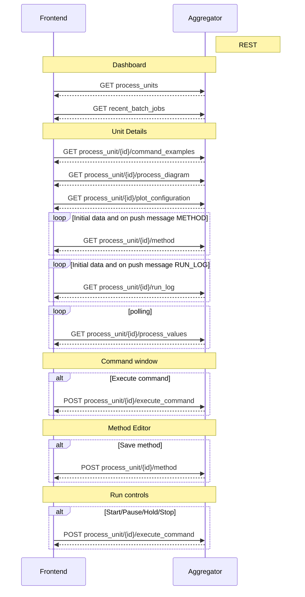
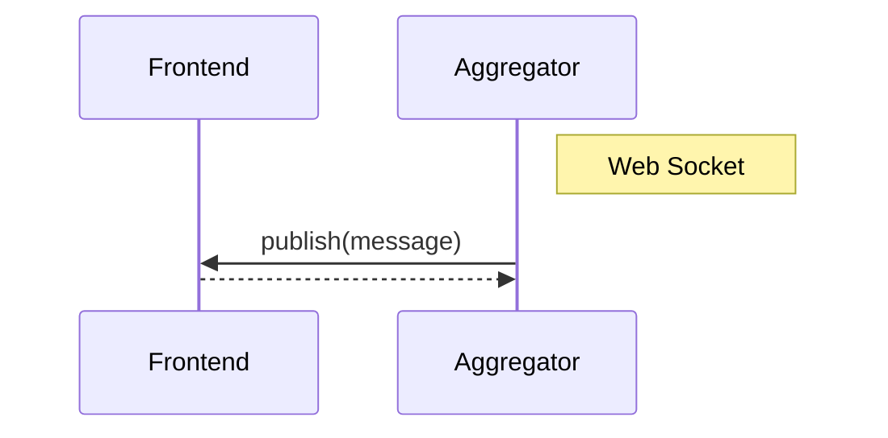
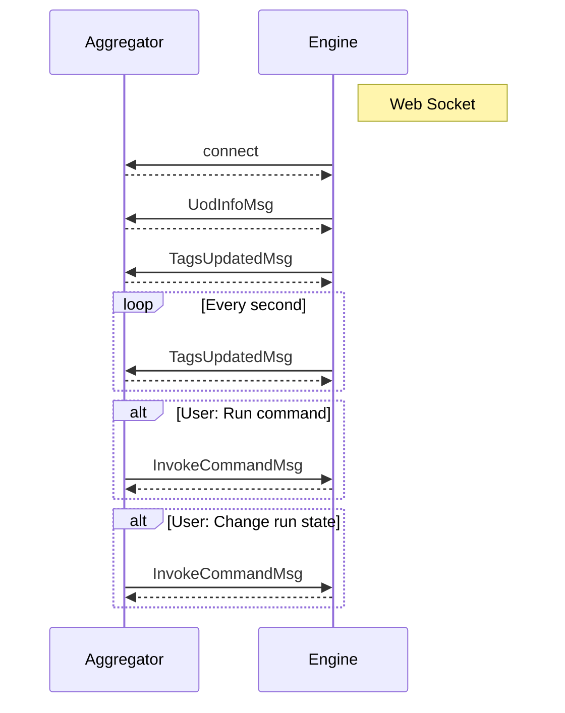
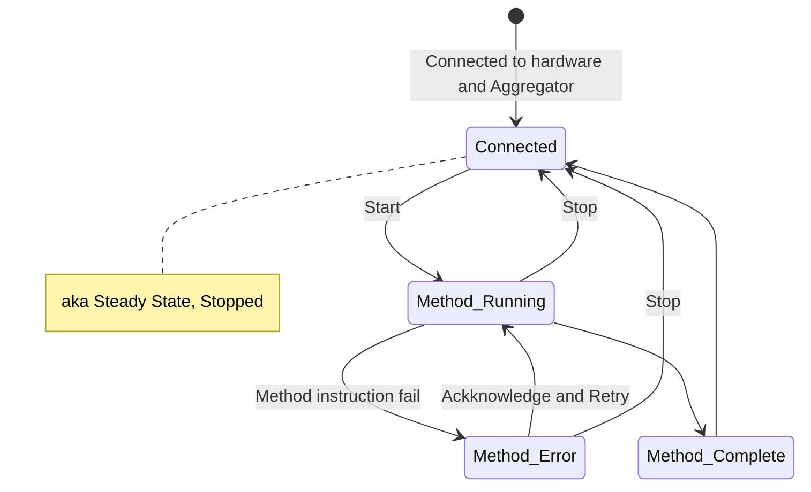
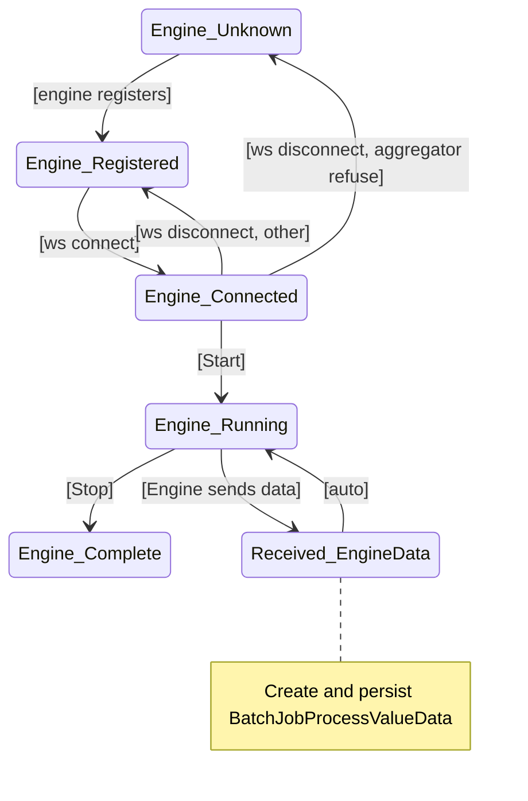
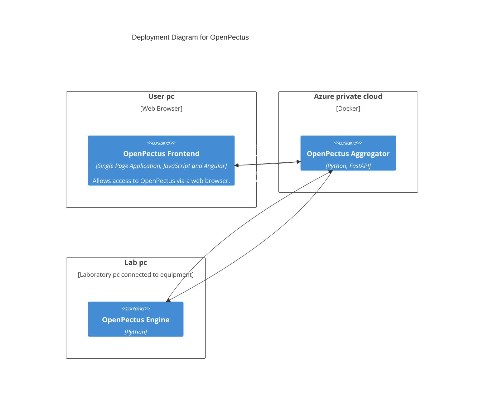

Notes:

# 1. Content
- [1. Content](#1-content)
- [2. Setup](#2-setup)
  - [2.1. Frontend setup](#21-frontend-setup)
  - [2.2. Backend setup](#22-backend-setup)
    - [2.2.1. One-time setup](#221-one-time-setup)
  - [2.3 Other commands](#23-other-commands)
    - [2.3.1 Update conda environment](#231-update-conda-environment)
    - [2.3.2 Build distribution](#232-build-distribution)
    - [2.3.3 Alembic database migrations](#233-alembic-database-migrations)
- [3. Running Open Pectus](#3-running-open-pectus)
  - [3.1. Aggregator](#31-aggregator)
  - [3.2. Engine](#32-engine)
  - [3.3. Docker](#33-docker)
- [4. User Authorization](#4-user-authorization)
  - [4.1. Azure AD](#41-azure-ad)
    - [4.1.1. Environment Variables](#411-environment-variables)
    - [4.1.2. Callback URL](#412-callback-url)
- [5. Components](#5-components)
  - [5.1. Pectus UI](#51-pectus-ui)
  - [5.2. Aggregator](#52-aggregator)
  - [5.3. Engine](#53-engine)
- [6. Build validation](#6-build-validation)
  - [6.1. Flake](#61-flake)
  - [6.2. Type checking](#62-type-checking)
    - [6.2.1. Pyright](#621-pyright)
  - [6.3. Code generation from API spec](#63-code-generation-from-api-spec)
- [7. Protocols](#7-protocols)
  - [7.1. Frontend - Aggregator](#71-frontend---aggregator)
    - [7.1.1 Rest](#711-rest)
    - [7.1.2 Websocket](#712-websocket)
  - [7.2. Engine - Aggregator](#72-engine---aggregator)
  - [7.3 State diagrams](#73-state-diagrams)
    - [7.3.1 Engine states](#731-engine-states)
    - [7.3.2 Aggregator states](#732-aggregator-states)
- [8. Deployment](#8-deployment)
  - [8.1 Deployment diagram](#81-deployment-diagram)
- [9. Unit Operation Definition](#9-unit-operation-definition)
  - [9.1 UOD file](#91-uod-file)
  - [9.2 Required options](#92-required-options)
  - [9.3 Hardware](#93-hardware)
  - [9.4 Registers](#94-registers)
  - [9.5 Tags](#95-tags)
    - [9.5.1 System Tags](#951-system-tags)
  - [9.6 Commands](#96-commands)
    - [9.6.1 Command arguments](#961-command-arguments)
    - [9.6.2 General arguments and parsers](#962-general-arguments-and-parsers)
  - [9.7 Process values](#97-process-values)
  - [9.8 Common scenarios:](#98-common-scenarios)
- [10 System Tags](#10-system-tags)
  - [10.1 System Tags Reference](#101-system-tags-reference)
- [11 Test Reporting](#11-test-reporting)

<!-- ToC and section numbering generated by "Markdown All in One" plugin for VSCode -->

# 2. Setup
This chapter describes how to set up a development environment to run and develop Open Pectus.


## 2.1. Frontend setup
Prerequisites: Node 20 (LTS) must be installed.

```shell
cd Open-Pectus/openpectus/frontend
npm ci
npm run build
```

## 2.2. Backend setup
Prerequisites:
- A conda installation. [Miniconda](https://docs.conda.io/en/latest/miniconda.html) is recommended.
  _Note: It is possible to install open pectus without conda but this will affect the global python environment on the developer pc
  so this in not recommended._
- Java SE SDK (optional, only needed for parser generation when updating P-code grammar)
  - The simplest way to get going using VS Code is this:
    - Install java using `conda install -c conda-forge openjdk`
    - Install VS Code extension 'ANTLR4 grammar syntax support' (https://github.com/mike-lischke/vscode-antlr4)
    - This should cause the Antlr plugin to automatically regenerate parser code whenever pcode.g4 is modified. 
    - openjdk-21.0.2 is known to work.

All the following commands can only be run from within the (mini)conda prompt, and from the `Open-Pectus` folder.

### 2.2.1. One-time setup

Create a new conda environment and install all dependencies:
```shell
conda env create -p=./conda --file=environment.yml
```

Activate the created pectus conda environment:
```shell
conda activate ./conda
```

Install open pectus in the environment:
```shell
pip install -e .
```

Set the SENTRY_DSN environment variable (optional):
To enable the sentry logger, the SENTRY_DSN environment variable needs to be set.
* Find the value by logging in to https://sentry.io and navigate to `settings/projects/openpectus/keys`
* Save the value as an environment variable on your developer pc:
```shell
setx SENTRY_DSN value
```


## 2.3 Other commands

### 2.3.1 Update conda environment
**To update an existing conda environment with all dependencies (e.g. when requirements.txt has changed):**
```shell
conda env update -p=./conda --file=environment.yml --prune
```

### 2.3.2 Build distribution
**To build a distribution:**
_The build server builds a distribution. This is not normally needed in a developer environment but can be necessary to test building docker images.
Optionally, to include frontend in the build, build the frontend and copy the contents of `openpectus/frontend/dist` into `openpectus/aggregator/frontend-dist` before building the distribution._

```shell
python -m build -o openpectus/dist
```

### 2.3.3 Alembic database migrations
**To create a new migration script:**  

Change the database model(s) in aggregator/data/models.py first, then run:
```shell
cd openpectus/aggregator
alembic revision --autogenerate -m "<migration script name>"
```
This will create a new migration script in `aggregator/data/alembic/versions/` based on the model changes.  
You **must** check that the changes within are acceptable, and change them if they are not.  
It is a good idea to ensure the downgrade step will leave data as it was.  
See https://alembic.sqlalchemy.org/en/latest/autogenerate.html#what-does-autogenerate-detect-and-what-does-it-not-detect for what autogenerate will and will not detect.

You can then test your migration with `alembic upgrade head` and `alembic downgrade -1`.  
`alembic upgrade head` is automatically run when aggregator starts, in aggregator/main.py main() function.

Currently, automatic tests touching the database does not use the migration scripts, so you can't trust those to verify the migrations.

SQLite has some severe limitations on what schema changes it supports. e.g. it doesn't support altering a column besides renaming it: https://sqlite.org/lang_altertable.html  
To alter e.g. a column type, you will need to create a new table, copy the data over, and then drop the old one.
Alembic supports this with "batch" migrations: https://alembic.sqlalchemy.org/en/latest/batch.html  
The autogenerate feature has been configured to generate with batch migrations as described here: https://alembic.sqlalchemy.org/en/latest/batch.html#batch-mode-with-autogenerate

The python driver for SQLite (pysqlite) does NOT support transactional DDL, i.e. running schema changes in a transaction so a failure during a schema change will roll all the changes back: https://docs.sqlalchemy.org/en/20/dialects/sqlite.html#transactional-ddl  
Alembic will run each migration separately, so if something fails, only the last change will require cleanup. https://github.com/sqlalchemy/alembic/issues/755#issuecomment-729110204  
There is possibly a workaround for this: https://docs.sqlalchemy.org/en/20/dialects/sqlite.html#serializable-isolation-savepoints-transactional-ddl but I believe Alembic would still not use it correctly as its behaviour in `alembic/runtime/migration.py` depends on the `transactional_ddl` flag set to False in `alembic/ddl/sqlite.py`

Even though the autogenerated migrations will include foreign key constraints, they are not enforced by SQLite by default, and while enabling them is possible in SQLAlchemy, it has some severe downsides: https://docs.sqlalchemy.org/en/20/dialects/sqlite.html#foreign-key-support

Even though `Mapped[]` python enum types produce Alembic Enums in the autogenerated migrations, they will not actually be enforced on database level without manually writing some CHECK constraints, or foreign keys to an enum table. It's unclear whether this would be worth the added complexity and management.

# 3. Running Open Pectus

## 3.1. Aggregator

To start a local aggregator service:

Prerequisites:
- [Frontend setup](#frontend-setup)
- [Backend setup](#backend-setup)

Run Aggregator to serve frontend from its default build directory. This also starts the
websocket protocol allowing Engines to connect.

```shell
cd Open-Pectus
pectus-aggregator -fdd .\openpectus\frontend\dist\
```

When Aggregator is running, the aggregator services are available, including:
- Frontend:       http://localhost:9800/
- OpenAPI UI:     http://localhost:9800/docs
- OpenAPI spec:   http://localhost:9800/openapi.json


## 3.2. Engine
Run Engine to connect a local engine to the Aggregator above:

```shell
cd Open-Pectus
pectus-engine --aggregator_host localhost --aggregator_port 9800
```


## 3.3. Docker

Prerequisites:
- [Frontend setup](#frontend-setup)
- [Backend setup](#backend-setup)

To start aggregator services in docker, run the following command.
Note: This depends on the frontend and backend builds being up-to-date.

```shell
cd Open-Pectus/openpectus
docker compose up --build
```

When the container is running, the aggregator services are available, including:
- Frontend:       http://localhost:8300/
- OpenAPI UI:     http://localhost:8300/docs
- OpenAPI spec:   http://localhost:8300/openapi.json


The frontend can now be used to verify that the engine is connected to the aggregator and to interact
with the engine.

An Engine can be started in the docker container using
```shell
pectus-engine --aggregator_host localhost --aggregator_port 8300
```


# 4. User Authorization

To ensure not everyone can access the data and control the experiments, as well as enable logging who did what, Pectus can integrate with an identity provider using an oAuth/OIDC login flow.

Currently, we only support Azure AD.

Idp integration is controlled through environment variables, to enable different setups for local development, test/staging servers, and production environments.

## 4.1. Azure AD
### 4.1.1. Environment Variables
Set the following environment variables:
- `ENABLE_AZURE_AUTHENTICATION`: true/false to enable/disable Azure AD integration.
- `AZURE_DIRECTORY_TENANT_ID`: The "directory tenant id" GUID for your Azure AD tenant/directory.
- `AZURE_APPLICATION_CLIENT_ID`: The client id for the pectus-specific configuration in Azure AD.

All three environment variables must be provided, (and `ENABLE_AZURE_AUTHENTICATION` set to `true`), for the integration to work.

### 4.1.2. Callback URL
The Azure AD pectus-specific configuration must also be configured to include `<your host>/auth-callback` where `<your host>` includes `http(s)://` and the port number, if it is not the default

E.g. if running locally on a development machine, using `npm start`, the callback url should be `http://localhost:4200/auth-callback`

# 5. Components

## 5.1. Pectus UI

This is a web application that allows users to view and interact with the Pectus system,
including runnings engines and process unit hardware attached to them.

## 5.2. Aggregator

There is one Aggregator service in a pectus system. It has the following responsibilities:

- Manage Engine services via a web-socket protocol
- Expose the Pectus UI web client application to end users
- Expose a rest API for Pectus UI
- Expose a web-socket API for Pectus UI. Used for two-way features not feasible in rest API.
- Expose a Language Server Protocol web-socket API for the Pectus UI code editor
- Parse and analyze pectus code (requires no running engine, only knowledge of the UOD)

## 5.3. Engine

An Engine service instance is required for each piece of process unit hardware. It has
the following responsibilities:

- Communicate with the hardware
- Expose hardware state as Tags
- Expose hardware interaction as Commands
- Parse(?), analyze(?) and run pectus code

# 6. Build validation

## 6.1. Flake
Flake is a python linter.

It is run by the build system to help ensure a decent code base. It outputs warnings and errors. The build will
fail if flake returns errors.

Run flake (note the directory - this matters):

```shell
cd Open-Pectus/openpectus
flake8
```

## 6.2. Type checking


### 6.2.1. Pyright
Pyright is a static type checker.

It is configured in pyproject.toml. Configuration reference: https://github.com/microsoft/pyright/blob/main/docs/configuration.md

To manually invoke, run
```shell
cd Open-Pectus
pyright
```

It is updated very frequently. To update it, run
```shell
pip install -U pyright
```

<!-- ## Diagram generation

To get started with diagram generation, run the following command from the `openpectus` directory:
`pyreverse -k .`
Pyreverse is installed as part of pylint (which is somehow already installed).
 -->

## 6.3. Code generation from API spec

The frontend generates and uses typescript skeleton interfaces from the Aggregator API spec.

To ensure that the implemented backend, the API specification file and the typescript interfaces all match, the flow for modification is as follows:
1. A change is made in the Aggregator API implementation.
2. The script `generate_openapi_spec_and_typescript_interfaces.sh` must be manually invoked. This updates the api spec file and generates updated typescript interfaces from it.
3. The frontend build must be run to check the updated interfaces. If the frontend build fails, the build server build will fail. This indicates an integration error caused
   by an incompatible API change. This should be fixed before the branch is merged, either by updating the frontend to support the API change or by reworking the API change to be compatible with the frontend.
4. Steps 1-3 must be repeated until both frontend and backend build successfully.
5. All changes must be committed to Git.

To ensure that step 2 is not forgotten, the aggregator test suite contains a test that checks that generates a new api spec file and checks that it matches the spec file last generated by the script. If it doesn't, the test fails and with it the Backend build.


# 7. Protocols

This chapter documents the Open Pectus Rest and Websocket protocols.

## 7.1. Frontend - Aggregator

The frontend-aggregator protocol is primarily REST-based, but includes push messages via Websocket.

### 7.1.1 Rest

The REST protocol contains these interactions:



### 7.1.2 Websocket

The Websocket interactions are all push messages that instruct the frontend to
request updates of a certain kind.

The available messages are: 
```RUN_LOG, METHOD, CONTROL_STATE, ERROR_LOG, PROCESS_UNITS```. The frontend knows
the relevant REST endpoints that correspond to each type of message.



## 7.2. Engine - Aggregator

This diagram gives provides an overview of the Engine-Aggregator protocol. This is the main protocol
in openpectus that ensures that aggregator is kept updated on engines (process units) and their states.
It also allows users of the frontend to control connected engines.

Note: This diagram shows a simplified overview. The actual protocol is more elaborate due to its built-in error
recovery. This allows it to support temporarily disconnected engines as well as updating and/or restarting 
Agregator during active runs. This is documented in the Error Recovery documentation:
[ERROR_RECOVERY.md]((ERROR_RECOVERY).md)



## 7.3 State diagrams

This chapter documents the important states and state changes in openpectus.

Note on transition naming:
- Lower case transitions (e.g. "register ok") denote some action in the system.
- Capitalized transitions (e.g. "Start") denote a specific command being executed.

### 7.3.1 Engine states

When an engine is started, it automatically connects to the hardware specified in its UOD and to
the Aggregator url specified as command line argument. It cannot function properly if either
of these connections are unavailable on startup (though the error recovery features will
continously attempt to recover).

Once both connections are in place, the engine is in state `Connected`. This means that:
- Engine is ready to receive commands or run a method.
- The scan cycle loop is started so tag values are continuously read from hardware
- Engine is displayed in the frontend dashboard as a process unit with status `Ready` 
- Engine details can be viewed in frontend details, including real-time updated values of its configured
tags.

This state is also referred to as *Steady State* (as opposed to states such as *starting/initializing/connecting/reconnecting*).

Avoid using the term `Running` the describe Engine state because is ambiguous. It might mean that engine is *Connected*/in *Steady State*, or it could mean that a method is running. The term `Connected` is used here and in the diagrams to referes to Engine in Steady State.

<!-- Notes:
- The `run_id` system tag is created by the `Start` command and cleared by the `Stop` command. -->





### 7.3.2 Aggregator states
The aggregator manages a number of Engines and tracks the state of each one.

Notes:
- Persistance of run state is based changes on the `run_id` system tag. If no longer set, save as recent run. 




# 8. Deployment

This chapter documents OpenPectus deployment aspects.

## 8.1 Deployment diagram

<!-- Mermaid C4 docs: https://mermaid.js.org/syntax/c4.html -->



# 9. Unit Operation Definition

This chapter contains information about creating and configuring a Unit Operation Definition (UOD). Its
intended audience is UOD authors and developers.

A UOD is a python code file that is loaded by the OpenPectus Engine. It describes the capabilities of 
a hardware unit and enables Pectus Engine to communicate with the hardware.

## 9.1 UOD file

To create a UOD, create a new file in the `openpectus/engine/configuration` directory. It should be named 
`hw_unit_name.py`. Underscore can be used to seperate words in the file name. Do not use spaces or dashes (-)
as this may cause problems importing the file as a python module. 

The minimal content is:
```
<imports>

def create() -> UnitOperationDefinitionBase:
    builder = UodBuilder()

    return (
        builder
        .with_instrument("DemoUod")
        .with_author("Demo Author", "demo@openpectus.org")
        .with_filename(__file__)
        .with_location("Demo location")
        .with_hardware_opcua(host="opc.tcp://192.168.0.1:4840")
        
        <additional details>

        .build()
    )
```

TODO The `<imports>` section is not yet stabile. At the time of writing the required imports are:
```
from openpectus.engine.uod_builder_api import (
    UnitOperationDefinitionBase, UodBuilder, UodCommand,
    tags,
    PlotConfiguration, SubPlot, PlotAxis, PlotColorRegion,
    RegexNumber, RegexText, RegexCategorical,
)
```

The content of `<additional details>` is shown below.

## 9.2 Required options

The following options are mandatory:
- instrument name: The name of the instrument/unit. Usually the same name as the UOD file but all characters
  are permitted, including spaces and dashes.
- author: The name and email address of the author of the UOD.
- filename: The file name of the UOD. Set with `with_filename(__file__)` to automatically fill in the correct
  file name.
- location: The name of the location that houses the hardware unit.
- hardware: See [9.3 Hardware](#93-hardware)

TODO Provide rationale/explanation of usage of the above options to the uod author

## 9.3 Hardware

OpenPectus has builtin support for the hardware protocols `OPCUA` and `Labjack`. The uod must specify which hardware to use
by using one of the builder methods: `with_hardware_opcua(host)` or `with_hardware_labjack(serial_number)`.
<!-- 
Two additional hardwares are available:
- `DemoHardware` - defined in `openpectus/engine/configuration/demo_uod.py` and is used to run OpenPectus Engine in demo mode
  without any hardware connected
- `Composite_Hardware` - allows combining multiple hardwares and using them as a single hardware.
-->

## 9.4 Registers

Registers are 'slots' in the hardware that can be read and/or written. The available registers depend entirely on the hardware.

Registers are defined using the `with_hardware_register(self, name: str, direction, **options):`
builder method. For an OPCUA unit, this may look like this:
```
with_hardware_register("FT01", "Read", path='Objects;2:System;3:FT01')
```
Note that the `name` argument specifies the name to use for the register inside OpenPectus while the `path`
option specifies how to refer to the register when communicating with the hardware.

Registers are not used directly. Instead register values are wrapped in instances of the `Tag` class. Two special
register options `to_tag` and `from_tag` specify how to convert between the register values (the raw values read
from the hardware)  and `tag` values (the values used in pcode). If these options are not set, no conversion of
the value is performed.

As an example, a unit may have a valve that is exposed as a register whose values are the integers 0 and 1. The
`to_tag` and `from_tag` options can be used to map theses values to a tag with the string values 'On' and 'Off' 
which would be a more natural choice for OpenPectus users.

## 9.5 Tags

A `tag` is a container for a value, typically a value that comes from a register. Other examples are the
[9.5.1 System Tags](#951-system-tags) and any custom tags that the UOD may define.

Tag values can be accessed from pcode, for example to express conditions based on the values while the pcode method runs.

Besides holding a value, a tag also has these properties:
- `name`: The name of the tag. Typically the same as the name of the register that provides the tag's value
- `unit`: The unit of the value or None for values with no unit. Example units are `kg`, `min`, `L`, and `L/h`
- `tick_time`: The time of the last value update, measured in seconds since the Epoch
- `direction`: Specifies how the value of the tag is obtained
  - `INPUT` - Tag is read from hardware, e.g. a sensor
  - `OUTPUT` - Tag is written to hardware, e.g. an actuator
  - `NA` - Tag is calculated/derived and neither read from or written to hardware
  - `UNSPECIFIED` - Not specified. The system may not be able to handle its values properly
- `safe_value`: Specifies a value that represents a safe position, e.g. an `OFF` value for a valve.

To define a tag, use the `with_tag` builder method. If a tag is given the same name as a register, the two
are automatically matched. This means that (depending on the directions of the register and tag), the register's
value and the tag are synchronized as appropriate.

NOTE: This API is not yet stabile. The with_tag method is expected to have variations for most known use cases,
e.g. `with_tag_choice` and `with_tag_reading` instead of the current implementation where the concrete Tag 
instance is given. We need to know more concrete tags to define this API.


### 9.5.1 System Tags

OpenPectus contains a number of tags that are always available and which are not related to registers.
See [10 System Tags](#10-system-tags) for details.

## 9.6 Commands

The UOD can define custom commands. These are python functions that define behavior for the unit and have
direct access to the hardware. As and example, we might want a Reset command that performs a number of things,
and make a simple 'Reset' command available in pcode.

We could additionally expose the Reset command as a button in the web frontend using [9.7 Process values](#97-process-values).

The actual implementation of a command should be a function in the UOD, for example
```
def reset(cmd: UodCommand, **kvargs) -> None:
    # implement command logic
    # possibly use one or more tags, available as cmd.context.tags
    # posibly using hardware directly, available as cmd.context.hwl
    # possily using the command instance, available as cmd.
    # raise ValueError if an error occurs, to report it to the user.
    pass
```

To make the function available as an OpenPectus command, it must be registered using
`with_command(name="Reset", exec_fn=reset)`.

Additional arguments are available to `with_command` that allows initialization, finalization
and custom argument parsing. 

### 9.6.1 Command arguments

Say we want to define a command with the pcode:
```
Power: 0.5
```
, i.e. a command that takes a single argument of type float.

The exec function of the command may look like this:
```
def power(cmd: UodCommand, number):
    number = float(number)
    ...
```

This can be achieved using the `with_command_regex_arguments` method:
```
.with_command_regex_arguments(
    name="Power",
    exec_fn=power,
    arg_parse_regex=RegexNumber(units=None)
    )
```

This allows OpenPectus to parse the argument to a float via a predefined regular expression, and pass it to the `power` function when the command is executed.

Note that, currently, the regex wil not convert the argument to a float. The execution
function needs to do that `number = float(number)`. The regex does ensure that this conversion will work. If the value cannot be parsed as a float, the regex parsing function will pause the method and alert the user.

Note that the argument names to the exec funcion are defined in the regular expression. RegexNumber defines 'number'
(and 'number_unit' if one or more units are given). The exec function argument must use the same name. Validation is 
built in to help ensure that arguments and names match up correctly. This validation runs at engine startup.

There are predefined regex parsers for numbers (RegexNumber), text (RegexText) and categorical values (RegexCategorical).


### 9.6.2 General arguments and parsers

It is advised to use `with_command_regex_arguments` and one of the predefined regular expressions for parsing if possible. 

However, in the general case, to support multiple arguments of different types, a custom parser can be defined. This can be achieved using a custom command parser passed to `with_command`.

Note that custom parsing cannot be validated during engine startup so any argument or name mismatch between argument parser
and execution function is not caught until the command is executed. In other words - make sure to test it properly.


## 9.7 Process values

In order for a `tag` to be shown in the OpenPectus web frontend, it must be defined as a process value with `with_process_value`. This has three purposes:
1. Select the tag to be displayed
2. Display the tag's current value (and unit if available)
3. Possibly allow the use to interact with the value, e.g. by setting a new value or excuting a command that is related
   to the `tag`.

The following types of interaction is supported:
- `with_process_value` - Read-only. The tag value is displayed but it cannot be modified
- `with_process_value_entry` - Read/write. The tag value is displayed and its value can be changed by clicking the
  value and typing the new desired value.
- `with_process_value_choice`. The tag value is displayed and when clicked, a list of commands
  are shown. When a command from the list is selected, the corresponding command is executed.


## 9.8 Common scenarios:

The Demo Uod included with OpenPectus includes most of the supported scenarios. It is located in 
`openpectus/engine/configuration/demo_uod.py`.

<!--
TODO show a few examples with register, tag, command and process value
TODO cover choice commands
TODO show example using regular expression helpers
-->


# 10 System Tags

The system tags are built into OpenPectus and automatically set by the system.

## 10.1 System Tags Reference

* `Connection Status`:
  `Connected`, `Disconnected`
  <br> 
  State of hardware connection. Is affected by error recovery so it will not show `Disconnected` until 
  recovery has been attempted and failed multiple times.

* `Method Status`:
  `OK`, `Error`
  <br> 
  Error state of the current method.

* `System State`:
  `Running`, `Paused`, `Holding`, `Waiting`, `Stopped`, `Restarting`
  <br>
  State of the current run / method.
  If `Paused` and `Holding` simultaneously, then `Paused` takes priority.

* `Clock`:
  <br>
  Number of seconds since epoch.

* `Run Time`:
  <br>
  Is reset to 00:00:00 when user starts method. Run timer increments when `System State` is not `Stopped`.

* `Process Time`:
  <br>
  Is reset to 00:00:00 when user starts method. Process time increments when `System State` is `Run`.

* `Block Time`:
  <br>
  `Block Time` maintains the process time of each block. It starts at zero and increments when `System State` is `Run`.
  When entering a new block it is reset to zero and when leaving a block, its value is restored to the time of the outer
  block plus the time of the inner block.  
  <del>
  Is reset to 00:00:00 when leaving a block due to `End block` or `End blocks`. Block time increments when `System State` is `Run`.
  </del>

* Accumulated Volume:
  <br>
  Set to 0.00 L when user starts method.

* Block Volume:
  <br>
  Set to 0.00 L when leaving a block due to `End block` or `End blocks`.

* Accumulated CV
  <br>
  Set to 0.00 CV when user starts method.

* Block CV
  <br>
  Set to 0.00 CV when leaving a block due to `End block` or `End blocks`.

* `Mark`
  <br>
  Holds value(s) assigned by the  `Mark`-instruction. Value is reset to the empty string each time archiver saves the current tag values.
  
* Base:
  `L`, `h`, `min`, `s`, `mL`, `CV`,  `g`, `kg` etc.
  <br>

* `Run Counter`:
  Integer value which can be assigned by the `Run counter` instruction or incremented by 1 by the
  `Increment run counter` instruction. The initial value is `0`. Is reset to `0` when user starts method.

<!--
* Batch:
  <br>
  Hold value assigned by `Batch`-instruction.
-->


# 11 Test Reporting

A test reporting tool is used to process test output and create an overview of test runs, both locally and on the build server.

The tool used is https://pypi.org/project/unittest-xml-reporting/. It runs the tests, processes the output and generates xml files
in xUnit format. This format is well established and supported by test reporting tools.

It is run with this command:
```
cd openpectus
python -m xmlrunner discover -t . -o test/test-reports/
```
which generates the xml files in the test-reports directory.

Bugger - the xml output cannot be read by https://github.com/marketplace/actions/test-reporter which fails with 
Error: TypeError: Cannot read properties of undefined (reading 'testsuite')

Trying https://pypi.org/project/junitxml/ instead:
```
python -m junitxml.main
```
Also fails:
Creating test report Tests Report
  Processing test results for check run Tests Report
  Error: Processing test results from openpectus/test/test-reports/junit.xml failed
Error: TypeError: Cannot read properties of undefined (reading 'testsuite')

Trying https://github.com/kyrus/python-junit-xml instead. It has a testsuites top element that may be what we need
pip install junit-xml - but you have to use your own runner...


To be shown as part of a Github build, the output must (?) be published as a build artefact.

It can then be shown in various ways, e.g
- https://github.com/marketplace/actions/publish-test-results
- 

Github official python docs:
https://docs.github.com/en/actions/use-cases-and-examples/building-and-testing/building-and-testing-python

We need to figure out how to consume a test report in a Github action
There are a few options for this:
- https://github.com/marketplace/actions/test-reporter (looks like the simplest option,
   in fact, this seems to not need a (seperate) artefact upload step)
- https://github.com/marketplace/actions/junit-report-action also seem simple
- and not require upload
- https://github.com/marketplace/actions/publish-test-results

No combination works - or the errors reported are not the real cause. We give up for now. Another attempt should start out with https://github.com/marketplace/actions/publish-test-results and a sample report,
possibly one from https://github.com/dorny/test-reporter/tree/main/__tests__
