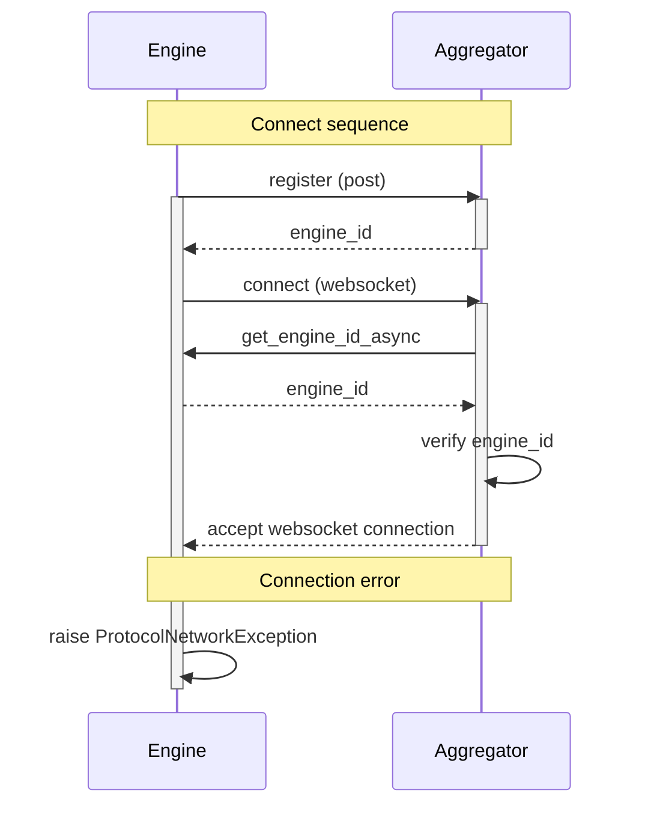
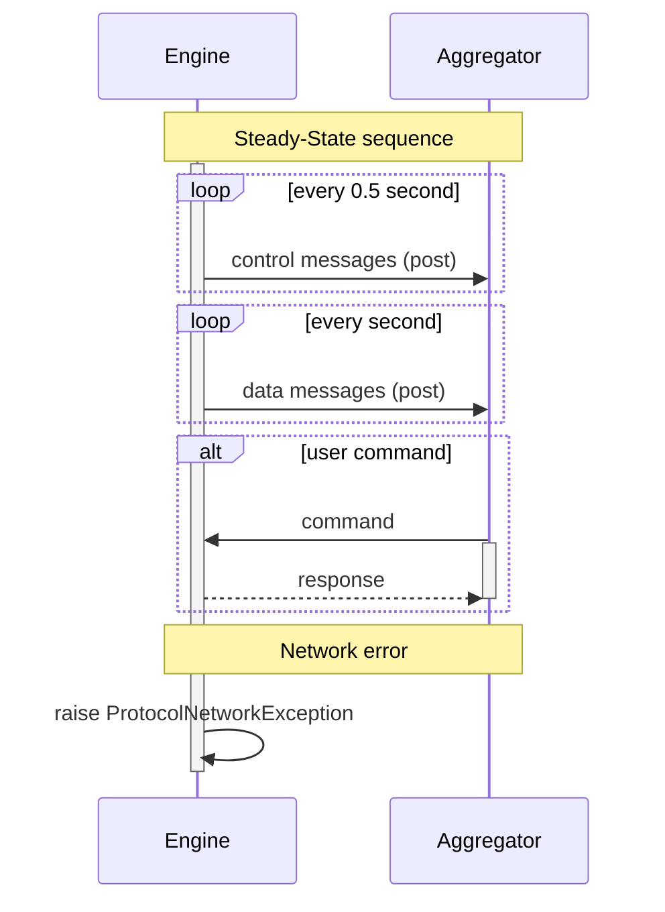
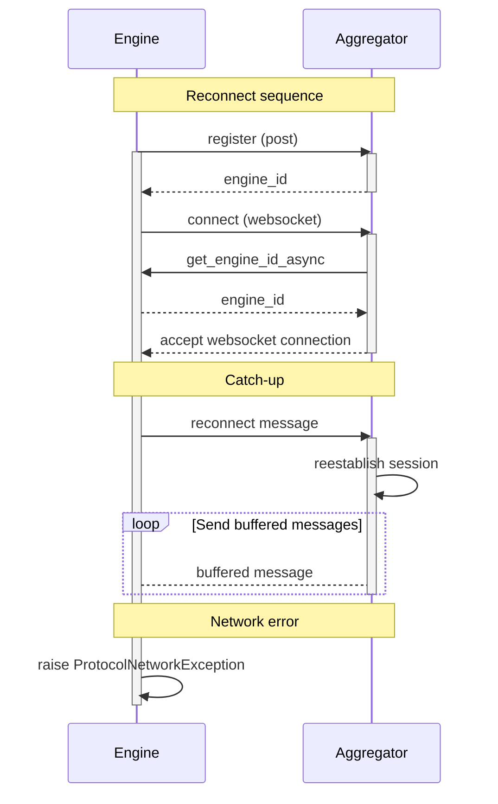
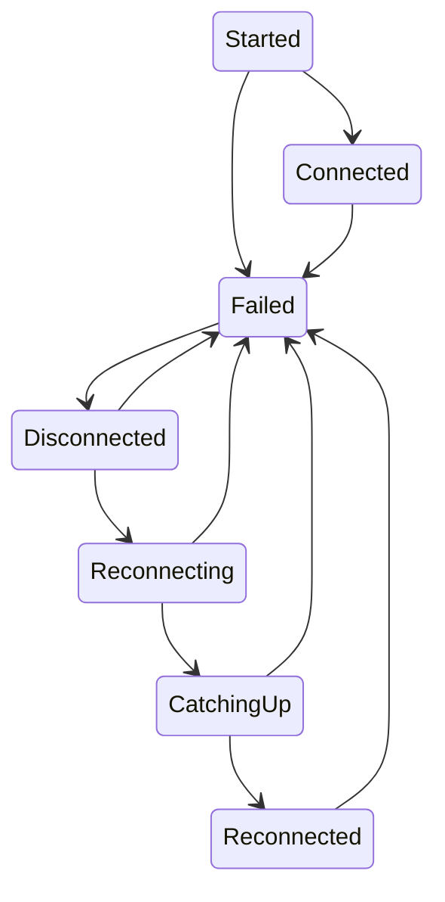

# Error Recovery - Detailed design

# 1. Content
- [Error Recovery - Detailed design](#error-recovery---detailed-design)
- [1. Content](#1-content)
- [2. Hardware errors](#2-hardware-errors)
  - [2.1  Overview](#21--overview)
  - [2.2 Implementation](#22-implementation)
- [3. Protocol errors](#3-protocol-errors)
  - [3.1 Overview](#31-overview)
  - [3.2 Engine](#32-engine)
  - [3.3 Aggregator](#33-aggregator)
  - [3.4 Diagram](#34-diagram)
    - [3.4.1 Connect sequence](#341-connect-sequence)
    - [3.4.2 Steady-State sequence](#342-steady-state-sequence)
    - [3.4.3 Reconnect sequence](#343-reconnect-sequence)
  - [3.5 Recovery states](#35-recovery-states)

# 2. Hardware errors
This chapter describes how hardware connection errors are handled and detailed design of the implementation.

## 2.1  Overview
Error recovery has the 5 states defined in `ErrorRecoveryState`, Disconnected, OK, Issue, Reconnect, Error.
It is configured using the time thresholds defined in `ErrorRecoveryConfig`.

Once connected, state is `OK`. This state is kept until a read or write error occurs (`read()`, `write()` or
one of the batch variants raise `HardwareLayerException`). Such an error causes state to transition to `Issue`.
In this state, if a success read/write occurs, state transitions back to `OK`. If no success read/write occurs
within a duration of `issue_timeout_seconds`, state is set to `Reconnect`.

In state `Reconnect`, reconnect attempts are started. If successful, state is set to `OK`. If not successful
within a duration of `error_timeout_seconds`, state is set to `Error`.

While in states `Issue` and `Reconnect`, any read and write errors are masked by returning last-known-good values for
reads and caching values for writes. This means that the Engine (and the user) will not notice the connection loss.

The one exception to this is uod commands. We have to assume that a uod command cannot execute correctly
without hardware connection so we have to fail uod commands. (A possible improvement would be to require uod
commands to consider the connection and fail with predefined exception types).

In state `Error`, reconnect attempts continue but errors are no longer masked. The `Connection Status` tag is set to
'Disconnected'. If reconnect is successful, state is set to `OK` and `Connection Status` is set to `Connected`.

The consequence of no longer masking errors, is that the Engine will enter the "paused on error" state where the
user can decide whether to continue or not.

Note: It is unlikely but possible that errors occur so soon after successful connection that no value is yet available
as last-known-good. In this case, a read returns a None value is returned and the error is logged.

## 2.2 Implementation
Error recovery is implemented using a decorator pattern around the HardwareLayerBase hardware abstraction class. The class
ErrorRecoveryDecorator implements the HardwareLayerBase interface by wrapping the concrete HardwareLayerBase class, e.g.
OPCUA_Hardware and delegating calls to it. However, when the concrete class fails with a connection related error, the 
decorator masks the read or write error as discussed above.

Reconnect note:
The implementation uses the tick() method to detect and execute reconnect. If this takes too long
and hurts engine timing, the hardware should instead implement its reconnect via threading.

# 3. Protocol errors
This chapter describes the handling of errors in the Engine-Aggregator connection and detailed design of the implementation.

## 3.1 Overview
The overall aim is to ensure that both Aggregator and Engine are rescilient to temporary connection errors. If the network is down 
during a run and then comes back up later, both Aggregator and Engine should be able to recover from this such that:
1. When the connection is lost
    - Engine creates a `ReconnectedMsg` that contains a snapshot of its state at the time of the disconnect
    - Engine begins buffering up samples of the data that can not be sent to Aggregator
      - If a run is active, engine keeps running the method
    - Aggregator notices that the Engine is unavailable and reports this status to the front end
      - Frontend should somehow display this state, similar to the "Interrupted by error" state
        - Commands cannot be sent to Engine
2. When the connection is recovered
    - Engine sends the `ReconnectedMsg` created earlier
    - Engine sends the buffered up values
    - Aggregator notices that Engine is available and reports this status to the front end
    - Aggregator processes the `ReconnectedMsg` to restore its `engine_data` state for the engine at the time of the disconnect.
      - If the run is still active, continue the run
      - If run is failed or completed, update the persisted state to reflect this, same as if it was connected when it happened
3. Aggregator restart must be supported such that
   - Any connected engines reconnect when aggregator comes back up
   - Aggregator detects whether engines are in an active run or have completed a run and stores the correct information

## 3.2 Engine
Error handling is added to engine_dispatcher which can detect connection errors and sample and batch up messages. When connection is reestablished,
data can be sent. Engine does not know or need to know about errors.

It is implemented as a decorator around EngineDispatcher and is transparent towards Engine and EngineReporter (clients of EngineDispatcher).
The low level connection handling in EngineDispatcher is autonomous and self-healing. EngineReporter is responsible for collecting the relevant
data from engine and sending it to aggregator using EngineDispatcher. When EngineDispatcher discovers that the connection is down, EngineReported
keeps collecting data and sending it as normal. It is only the decorator buffers up the data (sampled per 5 seconds by default) and sends it once
the connection is restored.

To make the dispatchers testable, base classes are introduced that contain non-network details. These are subclassed in production versions
using rest/websockets and in test versions using direct connection.

## 3.3 Aggregator
To make Aggregator rescilient towards connection errors, litte is needed. When an engine is disconnected, the websocket on_disconnect callback
fires and the data for en engine is removed. Additionally, the engine data is saved as a RecentEngine.

TODO figure out if we have enough data saved and whether we need to do more on engine connect.

## 3.4 Diagram
### 3.4.1 Connect sequence

<!-- Mermaid syntax: https://emersonbottero.github.io/mermaid-docs/syntax/sequenceDiagram.html -->

When engine starts, it starts the Connect sequence.

### 3.4.2 Steady-State sequence
When the Connect sequence has executed successfully, the Steady-State sequence is activated.

### 3.4.3 Reconnect sequence
When a ProtocolNetworkException is encountered in either the Connect sequence or the Steady-State sequence, the error recovery mechanism switches to the Reconnect sequence.

The Reconnect sequence is just the Connect sequence followed by
* a single ReconnectEngMsg (which allows the aggregator to restore its state for the particular engine)
* a number of data and control messages that were buffered up while the Engine was disconnected.

If a network error occurs, the sequence is reset and started again.

When the Reconnect sequence (including Catch-up) is complete, the Steady-State sequence is activated.

## 3.5 Recovery states
These are the system states of connection revovery in the Aggregator-Engine protocol.

It is implemented in the `engine.engine_runner` module.

