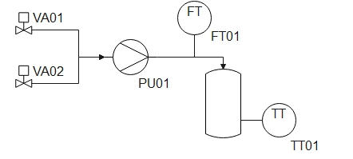

Welcome to the Open Pectus documentation!
=========================================
Open Pectus is a process control system for Unit Operations such as filtration, chromatography, precipitation, solubilization and refolding. Open Pectus is considered the reference implementation of the P-code language which is used to write methods and control components on the Unit Operation.

Open Pectus distinguishes itself as a process control system by giving the user access to and control of the machine code that is executed. The user is free to write P-code by hand but the intention is also that P-code can be generated with high-level wizards. P-codes are executed "live" and even a running method can be changed and extended.

The backend of Open Pectus is written in Python and the frontend is written in Angular.

Open Pectus is currently developed by Novo Nordisk A/S and Mjølner Informatics A/S and released under a GNU All-Permissive License.

.. note::

   This project is under active development. A working state is expected sometime in 2023.

Terms in Process Engineering
----------------------------
Open Pectus is developed to suit the needs of unit operations in the process manufacturing industry. This is deeply embedded in Open Pectus and the P-code language. The following gives a brief introduction to the terms, concepts and notions in this field.

A factory which produces a product is typically made up of a sequence of *unit operations*. A unit operation is a building block which accomplishes a task in the sequence. A unit operation could be a reaction process or a separation process. Typical processes could be fermentation, centrifugation and filtration.

A unit operation is itself made up of a number of *components* such as valves, temperature sensors, flow meters, pumps etc.

The reading on a temperature sensor is typically called a *process value* and the temperature measurement point is called a *tag*. A tag can be an input or an output. For instance a temperature measurement is an input and a stirrer speed is an output.

Terms in Open Pectus
^^^^^^^^^^^^^^^^^^^^
Open Pectus introduces the notion of a *machine instruction*. A machine instruction is simply an instruction for the machine to do something. For instance opening a valve. Machine instructions can affect any number of outputs and take into account any number of inputs.

A *method* is a series of machine instructions organized line by line that are executed sequentially.

The Case for Open Pectus
------------------------
Typically, a factory produces a limited range of products that are quite similar in their method of production. The unit operations that make up the factory are (hopefully!) designed to meet the goals of the factory. However, the components on the unit operation are always more general in nature. For instance a valve does not care whethere it shuts off skimmed milk or apple juice.

Consequently a unit operation in a factory is typically not built to fulfill any task that the components might support. Instead it fulfills the narrow task that the factory requires. This restriction stems mostly from automation which is surprisingly even more closely coupled to the task of the factory than the physical components on the unit operation.

The bottom line is that the full potential of unit operations are not fully realized and often the limitations stem from the implementation of automation.

This is entirely on purpose, as it is clearly described in the `S88 standard <https://en.wikipedia.org/wiki/ISA-88>`_.
The well meaning intention is to take all of the complexity that a unit operation offers and then to condense it into a few simple *commands*. The idea is that the engineer who has to manage a lot of unit operations, can manage them with high level commands instead of having to keep thousands of valves in memory.
 
This is mostly acceptable for single purpose machines such as purified water supplies, steam generators and waste discharge systems. It is however a significant disadvantage for rate-limiting unit operations where significant gains might be obtainable by relieving the operator of automation limitations.

Machine instructions and methods allow for very precise, detailed control as well as for the complexity reduction of S88.

Architecture
------------
On a high level, Open Pectus consists of three separate parts:

#. Engine which executes commands and methods and interacts with the Unit Operation I/O for a single Unit Operation. The Engine connects with the Aggregator.
#. Aggregator facilitates communication between end users and engines.
#. Web frontend user interface

The arcietecture is sketched in :numref:`open-pectus-architecture`. 

.. _open-pectus-architecture:
.. mermaid::
    :caption: Open Pectus architecture.
    :align: center
    
    graph LR
        X[End user 1]--> A
        X --> |WebSockets| B
        Y[End user 2]--> A
        Y --> |WebSockets| B
        Z[End user 3]--> A
        Z --> |WebSockets| B
        subgraph vm[<b>Virtual machine</b>]
            A[Web frontend] 
            B[Aggregator]
        end
        subgraph uo3[<b>Computer at site B</b>]
            B <--> |WebSockets Engine API| E[Engine i]
            E <--> |OPC-UA| H[Unit Operation i]
        end
        subgraph uo1[<b>Computer at site A</b>]
            B <-->|WebSockets Engine API| C[Engine 1]
            C <--> |OPC-UA| F[Unit Operation 1]
            B <-->|WebSockets Engine API| D[Engine 2]
            D <--> |OPC-UA| G[Unit Operation 2]
        end

In practice all parts can be placed on the same computer and run entirely locally.
The main benefit of the architecture is that it suits corporate environments. Only 1 computer with elevated network priviliges is required, namely the aggregator, while the engines and end users do not need accesses or priviliges beyond standard.

End User
^^^^^^^^
The end user is someone who executes processes on the Unit Operation. The user accesses Open Pectus through a web browser such as Microsoft Edge. A typical end user might be a chemist, technician or operator.

Web Frontend
^^^^^^^^^^^^
The user inferface is a web site which gives an overview of all of the available engines and their status. The user can enter into a specific engine, running or not, create and edit methods, issue machine instructions directly, start and stop execution of a method etc. A live plot shows data from the current method execution in context and a panel of tags shows current process values.

The web frontend can be integrated with a single-sign-on solution such as Azure to facilitate identification of users. This ID is used for logging as well as for storing user preferences.

Data is transferred between the Web Frontend and the sever through a bi-directional WebSockets API.

Aggregator
^^^^^^^^^^
The aggregator aggregates multiple Engines into one interface so that the End User has a single point of entry.

Engine
^^^^^^
The Engine executes commands, runs methods and handles I/O with the Unit Operation it serves. The engine is configured in a Unit Operation Definition which contains information on I/O, process variables (tags) and Machine Instructions.

Engines are decentral and register with the central aggregator without prior configuration of the aggregator thus forming a de-centralized structure.

P-code Language
---------------

The P-code language is the heart of Open Pectus. During the development of the language it was discovered that it can actually be considered a derivative of the `G-code <https://en.wikipedia.org/wiki/G-code>`_ language adapted to the needs in the process industry.

G-code concepts
^^^^^^^^^^^^^^^^^^^
The G-code language is a collection of instructions to execute certain commands and macros (collections of operations) on CNC machines such as laser cutters, mills, lathes and 3D printers. Instructions consist of an identifier and possibly a number of arguments and are stated plain text. An example of a G-code to move a tool along a circular path is given below:

.. code-block:: gcode

    G17 G20 G90 G94 G54
    G0 Z0.25
    X-0.5 Y0.
    Z0.1
    G01 Z0. F5.
    G02 X0. Y0.5 I0.5 J0. F2.5
    X0.5 Y0. I0. J-0.5
    X0. Y-0.5 I-0.5 J0.
    X-0.5 Y0. I0. J0.5
    G01 Z0.1 F5.
    G00 X0. Y0. Z0.25

Users of CNC machines do not typically write G-code by hand, which is reasonable considering the readability of the code above. Instead, users generate G-code using a tool chain involving a CAD tool, a CAM tool and a post processor.

..
    The CAD tool is used to make a 3D drawing of the desired part. This drawing is transferred into a CAM tool which has a 3D model of the starting material (a block of steel perhaps). The user would also specify the tools which are at the CNC machines' disposal in the CAM tool. Based on 1) the desired part, 2) the raw material and 3) the tools the CAM tool can generate paths that the tool must travel to make the necessary cuts. Finally, a post processor translates this representation of the paths into G-code which can be executed on the CNC machine. This tool chain is depicted in Figure 2.

..
    Figure 2. Sketch of CNC machining process.

P-code adopts the concept of machine codes in text format which can be modified, even when running, as well as the idea of synthesizing these machine codes with a tool chain.

P-code
------
The P-code language consists of instructions, control structures and a set of tags that encapsulate the state of the unit operation under control.

While the P-code syntax and control structures are static the instruction set and tag space are not. Different unit operations serve different purposes and as such they require different instruction sets and provide different process values. The unit operation specifics are defined in a Unit Operation Definition which is loaded when an engine session is initiated, and cannot be changed during runtime.

Syntax
^^^^^^
In abstract terms a P-code instruction consists of the following:
* Indentation (4 spaces is one level of indentation)
* Timeline threshold (optional)
* Instruction name
* Instruction argument(s) (optional for some instructions)
* Comment (optional)

A single valid P-code instruction will match the following regular expression:

:code:`(?P<indent> {4})*((?P<threshold>\d*(\.\d*)?)\s)?(?P<instruction_name>[^:#]+\b)(: (?P<argument>[^#\n]+\b))?(\s*#\s*(?P<comment>.*$))?`

Here is a breakdown:

* :code:`(?P<indent> {4})*` matches multiples of 4 white space
* :code:`((?P<threshold>\d*(\.\d*)?)\s)?` matches a positive decimal number
* :code:`(?P<instruction_name>[^:#]+\b)` matches an instruction name
* :code:`(: (?P<argument>[^#\n]+\b))?` matches an instruction argument
* :code:`(\s*#\s*(?P<comment>.*$))?` matches a comment

An example of a valid P-code instruction:

.. code-block:: pcode

    1.0 Command name: Argument, with special ? characters # This is *technically* a valid instruction.

Instructions are processed sequentially, in order of appearance, and as soon as possible.
A list of instructions is called a *method*.

Control Structures
^^^^^^^^^^^^^^^^^^
In contrast to the instruction set, the set of control structures is the same for all Unit Operations and cannot be altered.

The following control structures are defined:

* | Block
  | Starts a new timeline. Instructions inside the block are interpreted and executed until End block is called.
* | Macro
  | Defines a named collection of instructions that can be called with a single command.
* | Watch
  | A Watch is a Block which is executed once when a condition is satisfied.
* | Alarm
  | An Alarm is a Block which is executed whenever a condition is satisfied.

Tags (Process Values)
^^^^^^^^^^^^^^^^^^^^^
P-code instructions act on tags which represent the state of the Unit Operation in question. As such, Open Pectus only defines a small number of generic tags. It is up to the Unit Operation Definition to define specific tags.

Unit Operation Definition
^^^^^^^^^^^^^^^^^^^^^^^^^
A Unit Operation Definition contains the following:

* Tag types (optional)
* Tags
* Mapping of process value tags to physical I/O
* Unit Operation specific instructions

Engine
------
The Engine connects with the Unit Operation I/O and executes instructions.
The state of the engine is defined by the following parameters:

* | Execute instructions flag (binary)
  | Toggles execution of instructions and progress of the method.

* | Pause flag (binary)
  | Inhibits execution of instructions, progress of the method, injection of instructions and forces output of pre-defined safe values to I/O.

* | Hold flag (binary)
  | Inhibits progress of the loaded method as well as injection of instructions.

* | Running Instructions (list of instructions)
  | List of instructions which are executed during a scan cycle. Instructions can be added to this list by the operator or by execution of the method. Instructions disappear from the list when their "completed"-flag is set.

When the engine is launched it continuously performs a scan cycle. The scan cycle is depicted in :numref:`engine-scan-cycle` and :numref:`execute-instructions`.

.. _engine-scan-cycle:
.. mermaid::
    :caption: Engine scan cycle.
    :align: center
    
    flowchart TD
        A[Pectus Engine started]
        --> B[Scan initiated]
        --> C[Read Process Image I/O]
        --> D{Started?}
        -->|True| F[Execute instructions and progress method]
        --> G[Write Process Image I/O]
        --> H[Scan finished]
        --> I[Pectus Engine stopped]
        D -->|False| G
        H --> B
        style F fill:#fae8dc

.. _execute-instructions:
.. mermaid::
    :caption: Execute instructions and progress method.
    :align: center
    
    flowchart TD
        %% Path when pause flag is set
        A[Execute instructions and progress method]
        --> B{Pause}
        --> C[True]
        --> D[Force pre-defined safe values on outputs]
        --> E[Finished]

        %% Path when hold flag is set
        B
        --> F[False]
        --> G{Hold}
        --> H[True]
        --> V

        %% Path when neither paused nor held
        G
        --> J[False]
        --> tickinstr
        subgraph tickinstr[ ]
        R[Tick active block] -->|Instruction| U{Instruction type}
        S[Tick active Watch blocks] -->|Instruction| U
        T[Tick active Alarm blocks] -->|Instruction| U
            U -->|Block| N[Assign active block]
            U -->|End block| O[Set parent block active]
            U -->|Watch interrupt| P[Activate watch block]
            U -->|Alarm interrupt| Q[Activate alarm block]
            U -->|Other| X[Append to active instructions]
            Y[Injected instructions] --> X
        end
        tickinstr --> V[Execute active instructions] --> W[Remove completed instructions from active instructions list] --> E
        style A fill:#fae8dc
    

P-code Example
--------------
Consider a process in which two different substances are pumped into a vessel through a mass flow meter which can register the volume. Upon addition of the second substance, heat is generated and it is desired to stop addition when a certain temperature is reached or when a certain maximum volume has been dosed. See :numref:`p-code-example-pid` for a Piping and Instrumentation Diagram of such a machine.

.. _p-code-example-pid:

    
    Piping and Instrumentation Diagram.

The P-code method might read as follows:

.. code-block:: pcode

    Base: L # Configure timeline to be in unit volume

    Block: Add substance 1
        Inlet: VA01 # Open shut-off valve for substance 1
        PU01: 10 % # Run at reduced speed for accurate dosage
        1.0 End block

    Block: Add substance 2
        Inlet: VA02 # Open shut off-valve for substance 2
        Watch: TT01 > 50 degC
            Mark: Addition stopped.
            End block
        1.5 End block

    PU01: 0 %

    Stop

Walkthrough
^^^^^^^^^^^
:code:`Base: L` is an instruction to configure the timeline to be in unit volume. It is inferred that this volume refers to the accumulated dosage measured by the flowmeter, as this is not explicitly stated in the P-code.

:code:`Block: Add substance 1` invokes the Block structure which starts a new timeline. Instructions nested inside refer back to this timeline. However, neither :code:`Inlet: VA01` nor :code:`PU01: 10 %` make use of this timeline - the absence of a threshold means that these commands run immediately when the block is entered. The :code:`1.0` in the following statement, :code:`1.0 End block` means that this instruction is not executed until the accumulated volume has reached the 1.0 L mark. Until this time, the machine state does not change.

Once 1.0 L of substance 1 has been added the block ends due to the :code:`End block` instruction and the execution picks up from the following line which is blank and thus is skipped.

Then, :code:`Block: Add substance 2` is invoked followed immediately by :code:`Inlet: VA02`. In this block, contrary to the previous one, the pump is not actuated. This is because it is still running at 10 % speed. Afterwards a Watch structure is invoked. The commands nested inside will execute once the criterion has been satisfied, in this case, when the temperature TT01 reads greater than 50 degrees centigrade. Until that is the case however, the instructions are skipped. The next valid instruction is :code:`1.5 End block` which ensures that no more than 1.5 L of substance 2 is dosed no matter how hot the mixture gets. If the Watch condition has not been met once :code:`End block` is invoked then it will stop monitoring for that condition.

The next lines are blank, then the pump is stopped by :code:`PU01: 0 %` followed by the :code:`Stop` instruction which terminates the sequence and brings the machine to the safe state: PU01 at 0 % and both valves VA01 and VA02 closed.

Contents
--------
.. toctree::

   Home <self>
   Reference
